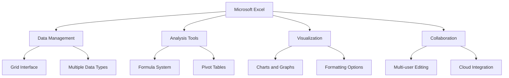
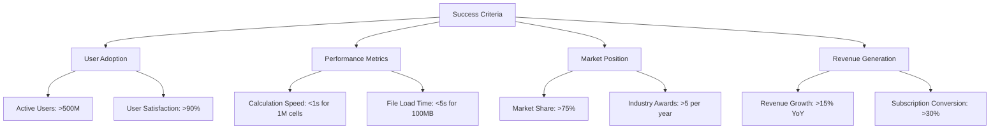
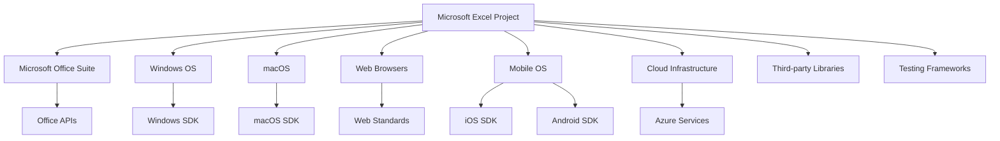
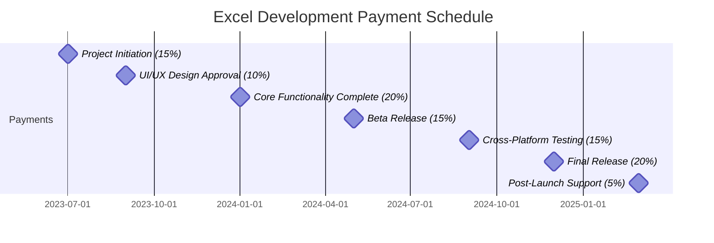
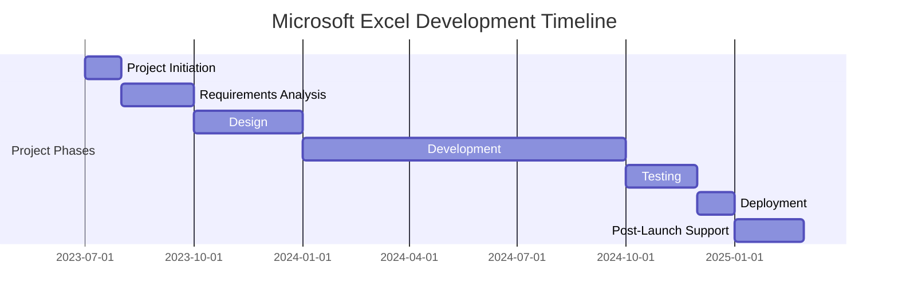
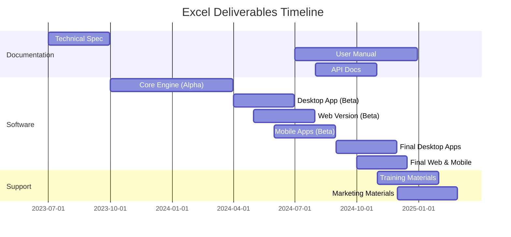

# EXECUTIVE SUMMARY

## PROJECT OVERVIEW

Microsoft Excel is a revolutionary spreadsheet software application designed to transform the way individuals and businesses organize, analyze, and visualize data. In response to the growing need for powerful yet user-friendly data management tools, Excel offers a comprehensive solution that combines intuitive design with advanced functionality. The software addresses the client's need for efficient data handling, complex calculations, and insightful data representation, all within a single, integrated platform.

## OBJECTIVES

1. Develop a robust, grid-based interface for seamless data input and manipulation
2. Implement a comprehensive formula system supporting complex calculations and data analysis
3. Create advanced charting and graphing capabilities for effective data visualization
4. Design an intuitive, ribbon-style toolbar to enhance user experience for both beginners and power users
5. Ensure cross-platform compatibility (Windows, macOS, web, and mobile)
6. Integrate cloud storage and syncing for seamless access across devices
7. Implement collaboration features to support multiple users working simultaneously

## VALUE PROPOSITION

Our agency offers unparalleled expertise in developing sophisticated software solutions that balance power with accessibility. For Microsoft Excel, we bring:

1. Deep understanding of user needs across various proficiency levels
2. Expertise in creating scalable, high-performance applications capable of handling large datasets
3. Experience in developing cross-platform solutions with seamless integration
4. Strong focus on user interface design, ensuring intuitive navigation and feature discovery
5. Proven track record in implementing robust calculation engines and data analysis tools
6. Commitment to ongoing support and feature enhancement based on user feedback and evolving market needs

## PROJECT OBJECTIVES

### BUSINESS GOALS

1. Establish Microsoft Excel as the industry-leading spreadsheet application
2. Increase market share in the productivity software sector
3. Enhance user productivity and efficiency across various industries
4. Drive adoption of the Microsoft Office suite through Excel's integration
5. Generate recurring revenue through subscription-based licensing models
6. Expand the user base by catering to both novice and advanced users
7. Foster a robust ecosystem of third-party add-ins and integrations

### TECHNICAL GOALS

1. Develop a high-performance calculation engine capable of handling large datasets
2. Implement a scalable and extensible formula system supporting complex operations
3. Create an intuitive, ribbon-style user interface for improved feature discoverability
4. Ensure cross-platform compatibility (Windows, macOS, web, and mobile)
5. Integrate cloud storage and real-time collaboration features
6. Optimize memory usage and processing speed for handling large workbooks
7. Implement robust data import/export capabilities supporting various file formats
8. Develop advanced data visualization tools with customizable charts and graphs
9. Create a flexible macro system and VBA environment for user-defined automation
10. Ensure seamless integration with other Microsoft Office applications

### SUCCESS CRITERIA

| Criterion | Target | Measurement Method |
|-----------|--------|---------------------|
| User Adoption | >500 million active users | Monthly Active Users (MAU) tracking |
| User Satisfaction | >90% satisfaction rate | User surveys and app store ratings |
| Performance - Calculation Speed | <1 second for 1 million cells | Automated performance testing |
| Performance - File Load Time | <5 seconds for 100MB file | Automated performance testing |
| Cross-Platform Availability | 100% feature parity | Feature comparison across platforms |
| Market Share | >75% in spreadsheet software category | Third-party market research reports |
| Revenue Growth | >15% year-over-year | Financial reports |
| Third-Party Integrations | >1000 approved add-ins | Microsoft AppSource metrics |
| Collaboration Adoption | >50% of users using co-authoring | Usage analytics |
| Industry Recognition | >5 major industry awards per year | Award tracking and documentation |

These success criteria will be regularly monitored and evaluated throughout the project lifecycle to ensure that Microsoft Excel meets and exceeds its objectives, maintaining its position as the premier spreadsheet application in the market.

## SCOPE OF WORK

### IN-SCOPE

1. User Interface Development
   - Grid-based interface for data input and manipulation
   - Ribbon-style toolbar for easy access to features
   - Customizable quick access toolbar
   - Cell, row, and column formatting options
   - Multiple worksheet support within a single workbook

2. Data Management and Analysis
   - Support for various data types (numbers, text, dates, currencies)
   - Comprehensive formula system with 400+ built-in functions
   - Advanced sorting and filtering capabilities
   - Pivot table functionality for data summarization
   - Data validation tools

3. Visualization and Reporting
   - Extensive charting and graphing capabilities (50+ chart types)
   - Conditional formatting for visual data analysis
   - Sparklines for inline data visualization
   - Print layout and page setup options

4. Automation and Extensibility
   - Macro recording and editing functionality
   - Visual Basic for Applications (VBA) support
   - Add-in development framework

5. Collaboration and Sharing
   - Real-time co-authoring capabilities
   - Comments and review features
   - Sharing options with granular permissions

6. Cross-Platform Development
   - Windows desktop application
   - macOS desktop application
   - Web-based version (Excel Online)
   - Mobile applications (iOS and Android)

7. Integration and Compatibility
   - Seamless integration with other Microsoft Office applications
   - Support for importing/exporting various file formats (CSV, XML, PDF)
   - Compatibility with older Excel versions

8. Performance Optimization
   - Large dataset handling (up to 1 million rows)
   - Multithreading for improved calculation speed
   - Memory optimization techniques

9. Cloud Services
   - OneDrive integration for cloud storage
   - Automatic saving and version history

10. Security Features
    - Workbook and worksheet protection options
    - Data encryption capabilities
    - Digital signature support for macros

### OUT-OF-SCOPE

1. Advanced database functionality (beyond basic data import/export)
2. Built-in project management tools
3. Advanced statistical analysis tools (beyond basic statistical functions)
4. Direct integration with non-Microsoft cloud storage services
5. Built-in machine learning or AI capabilities
6. Specialized industry-specific templates or functions
7. Direct integration with third-party data visualization tools
8. Built-in version control system (beyond basic version history)
9. Advanced data cleansing or ETL (Extract, Transform, Load) tools
10. Built-in collaboration tools beyond basic co-authoring (e.g., video conferencing)

### ASSUMPTIONS

1. Microsoft will provide necessary access to existing codebase and documentation
2. The development team has expertise in C++, .NET, and web technologies
3. Adequate testing environments will be available for all supported platforms
4. Microsoft's existing cloud infrastructure can support the planned cloud features
5. Necessary licenses for third-party components or libraries are obtainable
6. User feedback and beta testing can be conducted within the project timeline
7. The project has full support from Microsoft's management and other relevant departments
8. Existing Microsoft Office APIs are stable and well-documented
9. The current Microsoft Office suite architecture supports the planned integrations
10. Regulatory compliance requirements for data handling and privacy are known and stable

### DEPENDENCIES

1. Microsoft Office Suite: Excel must integrate seamlessly with other Office applications
2. Operating Systems: Windows and macOS for desktop versions
3. Web Browsers: For Excel Online functionality
4. Mobile Operating Systems: iOS and Android for mobile versions
5. Microsoft Cloud Infrastructure: For cloud storage and syncing features
6. Office APIs: For integration with other Office applications
7. Windows SDK and macOS SDK: For desktop application development
8. Web Standards: HTML5, CSS3, and JavaScript for web version
9. iOS SDK and Android SDK: For mobile application development
10. Azure Services: For cloud-based features and services
11. Third-party Libraries: For specific functionalities (e.g., charting libraries)
12. Testing Frameworks: For automated testing across all platforms
13. Localization Services: For supporting multiple languages
14. Accessibility Tools: To ensure compliance with accessibility standards
15. Security and Encryption Libraries: For implementing data protection features

# BUDGET AND COST ESTIMATES

## COST BREAKDOWN

The following table provides a detailed breakdown of the estimated costs for the Microsoft Excel project:

| Category | Description | Cost (USD) |
|----------|-------------|------------|
| Labor | Development Team (20 developers x 18 months) | $10,800,000 |
| | UI/UX Design Team (5 designers x 12 months) | $1,500,000 |
| | Quality Assurance Team (10 testers x 18 months) | $3,600,000 |
| | Project Management (2 managers x 18 months) | $720,000 |
| Software Licenses | Development tools and third-party libraries | $500,000 |
| Hardware | Development and testing equipment | $300,000 |
| Cloud Infrastructure | Azure services for development and testing | $400,000 |
| User Research | Focus groups and usability studies | $250,000 |
| Localization | Translation and adaptation for 25 languages | $625,000 |
| Marketing | Pre-launch marketing campaign | $1,000,000 |
| Contingency | 10% of total budget for unforeseen expenses | $1,969,500 |
| **Total** | | **$21,664,500** |

## PAYMENT SCHEDULE

The payment schedule is structured around key project milestones:

| Milestone | Payment Percentage | Estimated Date | Amount (USD) |
|-----------|---------------------|----------------|--------------|
| Project Initiation | 15% | July 1, 2023 | $3,249,675 |
| UI/UX Design Approval | 10% | September 1, 2023 | $2,166,450 |
| Core Functionality Complete | 20% | January 1, 2024 | $4,332,900 |
| Beta Release | 15% | May 1, 2024 | $3,249,675 |
| Cross-Platform Testing | 15% | September 1, 2024 | $3,249,675 |
| Final Release | 20% | December 1, 2024 | $4,332,900 |
| Post-Launch Support | 5% | March 1, 2025 | $1,083,225 |

## BUDGET CONSIDERATIONS

1. **Technology Changes**: Rapid advancements in web and mobile technologies may require additional resources for adaptation.

2. **Scope Expansion**: Client requests for additional features could impact the budget. A change management process will be implemented to assess and approve scope changes.

3. **Performance Optimization**: Achieving the desired performance levels for large datasets may require additional development time and resources.

4. **Cross-Platform Compatibility**: Ensuring consistent functionality across all platforms may present unforeseen challenges, potentially increasing development and testing costs.

5. **Third-Party Integrations**: Changes in third-party APIs or services may necessitate additional development work.

6. **Cybersecurity Measures**: Evolving security threats may require implementation of additional security features, impacting the budget.

7. **Regulatory Compliance**: Changes in data protection regulations could require additional development and legal consultation.

8. **Cloud Infrastructure Costs**: Fluctuations in cloud service pricing or higher-than-expected usage during development could affect infrastructure costs.

9. **Exchange Rate Fluctuations**: For international resources and services, currency exchange rate changes could impact the budget.

10. **Talent Acquisition and Retention**: Competitive job market conditions may necessitate higher compensation for key roles.

To manage these considerations:

- A contingency fund of 10% has been included in the budget.
- Regular risk assessments will be conducted to identify and mitigate potential budget impacts.
- Agile development methodology will be employed to allow for flexibility in prioritizing features based on budget constraints.
- Continuous monitoring of industry trends and regulatory changes will be performed to anticipate potential impacts.
- Clear communication channels with Microsoft will be established to quickly address and resolve any budget-related concerns.

# TIMELINE AND MILESTONES

## PROJECT TIMELINE

The development of Microsoft Excel is planned to span 18 months, divided into several key phases:

## KEY MILESTONES

| Milestone | Description | Target Date |
|-----------|-------------|-------------|
| Project Kickoff | Initial team assembly and project setup | 2023-07-01 |
| Requirements Finalization | Completion of detailed requirements document | 2023-09-30 |
| UI/UX Design Approval | Finalization of user interface designs | 2023-12-31 |
| Core Functionality Complete | Basic spreadsheet operations and formula system implemented | 2024-04-30 |
| Advanced Features Integration | Implementation of charts, pivot tables, and macros | 2024-07-31 |
| Beta Release | Internal testing version ready | 2024-09-30 |
| Cross-Platform Testing Complete | Verification of functionality across all supported platforms | 2024-11-30 |
| Final Release | Official launch of Microsoft Excel | 2024-12-31 |
| Post-Launch Review | Evaluation of initial user feedback and performance metrics | 2025-02-28 |

## CRITICAL PATH

The following tasks represent the critical path for the Microsoft Excel project:

1. Requirements Analysis and Specification (2 months)
   - Crucial for defining the scope and features of Excel
   - Delays here will impact all subsequent phases

2. Core Architecture Design (1 month)
   - Establishes the foundation for the entire application
   - Critical for ensuring scalability and performance

3. Development of Core Spreadsheet Engine (3 months)
   - Includes grid interface, data handling, and basic formula system
   - Essential functionality that other features depend on

4. Implementation of Advanced Formula System (2 months)
   - Key differentiator for Excel's functionality
   - Impacts data analysis capabilities

5. Cross-Platform Development (4 months)
   - Ensures consistent functionality across Windows, macOS, web, and mobile
   - Critical for meeting multi-platform objectives

6. Integration of Cloud Services (1 month)
   - Enables collaboration features and cross-device synchronization
   - Important for modern workflow support

7. Comprehensive Testing Phase (2 months)
   - Crucial for identifying and resolving issues across all platforms
   - Ensures product quality and reliability

8. Performance Optimization (1 month)
   - Critical for handling large datasets and complex calculations
   - Essential for user satisfaction and competitive advantage

9. Final Integration and Deployment Preparation (1 month)
   - Brings together all components for the final product
   - Last step before release, critical for launch success

Maintaining progress on these critical path items is essential for keeping the project on schedule. Any delays in these areas should be immediately addressed and mitigated to prevent overall project delays.

# DELIVERABLES

## LIST OF DELIVERABLES

1. Software Components
   - Microsoft Excel Desktop Application (Windows and macOS versions)
   - Microsoft Excel Online (Web version)
   - Microsoft Excel Mobile Applications (iOS and Android)
   - Excel Add-in Development Kit

2. Documentation
   - Technical Specification Document
   - User Manual
   - API Documentation
   - Developer Guide
   - System Architecture Document
   - Database Schema Documentation

3. Training Materials
   - End-User Training Guide
   - Video Tutorials (Beginner, Intermediate, Advanced)
   - Administrator Training Manual
   - Developer Training Resources

4. Quality Assurance
   - Test Plans and Test Cases
   - Bug Reports and Resolution Documentation
   - Performance Test Results

5. Deployment Package
   - Installation Packages for Desktop Versions
   - Deployment Guide for IT Administrators

6. Marketing Materials
   - Product Brochures
   - Feature Highlight Sheets
   - Case Studies

7. Legal and Compliance
   - Software License Agreement
   - Privacy Policy
   - Data Processing Agreement

## DELIVERY SCHEDULE

| Deliverable | Expected Delivery Date |
|-------------|------------------------|
| Technical Specification Document | 2023-09-30 |
| UI/UX Design Mockups | 2023-12-31 |
| Excel Core Engine (Alpha Version) | 2024-03-31 |
| Desktop Application (Beta Version) | 2024-06-30 |
| Web Version (Beta) | 2024-07-31 |
| Mobile Applications (Beta) | 2024-08-31 |
| User Manual (Draft) | 2024-09-30 |
| API Documentation | 2024-10-31 |
| Final Desktop Applications | 2024-11-30 |
| Final Web and Mobile Versions | 2024-12-15 |
| Complete Documentation Set | 2024-12-31 |
| Training Materials | 2025-01-31 |
| Marketing Materials | 2025-02-28 |

## ACCEPTANCE CRITERIA

1. Software Components
   - Successfully install and run on specified platforms without critical errors
   - Meet all functional requirements as outlined in the Technical Specification Document
   - Achieve performance benchmarks (e.g., load time < 5 seconds for 100MB file)
   - Pass security audit with no high-severity vulnerabilities
   - Achieve 100% feature parity across platforms where applicable

2. Documentation
   - Complete coverage of all features and functionalities
   - Technically accurate and up-to-date with the final software version
   - Clearly written and understandable by the target audience (e.g., users, developers)
   - Proper formatting, indexing, and searchability

3. Training Materials
   - Cover all key features and use cases
   - Include hands-on exercises and examples
   - Receive positive feedback from a test group (>80% satisfaction rate)

4. Quality Assurance Deliverables
   - Test coverage of at least 95% for critical components
   - All high and medium priority bugs resolved
   - Performance test results meet or exceed specified benchmarks

5. Deployment Package
   - Successful installation on clean systems without errors
   - Clear, step-by-step instructions for various deployment scenarios

6. Marketing Materials
   - Accurate representation of product features and benefits
   - Consistent branding and messaging
   - Approval from Microsoft's marketing department

7. Legal and Compliance Documents
   - Reviewed and approved by legal department
   - Compliant with relevant laws and regulations (e.g., GDPR, CCPA)

| Deliverable Category | Acceptance Criteria |
|----------------------|---------------------|
| Software Components | - Successful installation - Meet functional requirements - Performance benchmarks achieved - Pass security audit - Cross-platform feature parity |
| Documentation | - Complete feature coverage - Technical accuracy - Clear writing - Proper formatting and searchability |
| Training Materials | - Comprehensive feature coverage - Practical exercises included - >80% test group satisfaction |
| QA Deliverables | - 95% test coverage for critical components - High/medium priority bugs resolved - Performance benchmarks met |
| Deployment Package | - Successful clean installation - Clear deployment instructions |
| Marketing Materials | - Accurate feature representation - Consistent branding - Marketing department approval |
| Legal Documents | - Legal department approval - Regulatory compliance |

Each deliverable will be reviewed against these criteria before being considered complete. Any deliverable not meeting the specified criteria will be revised until it meets the required standards.