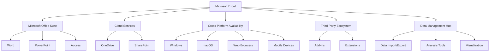
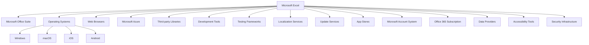
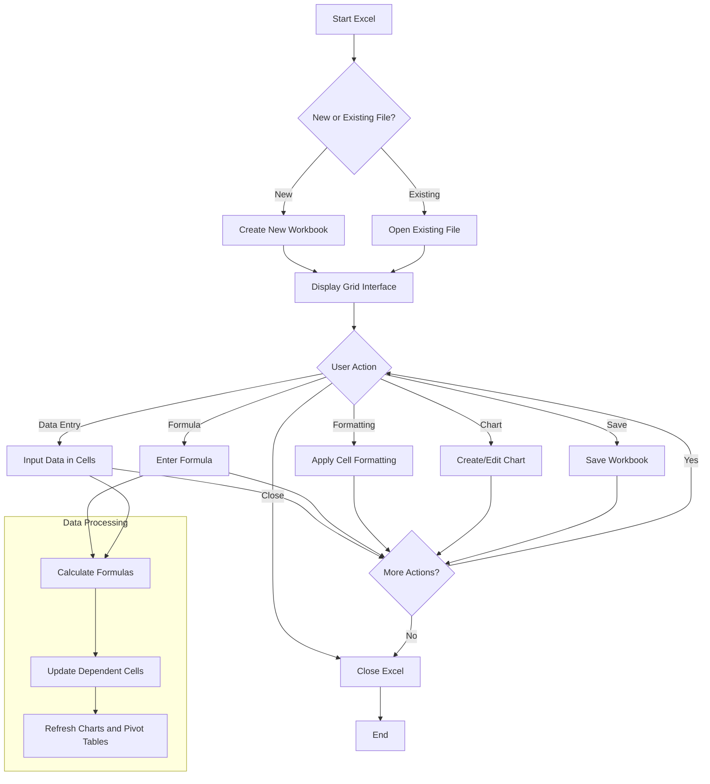
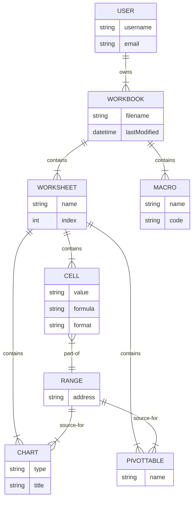
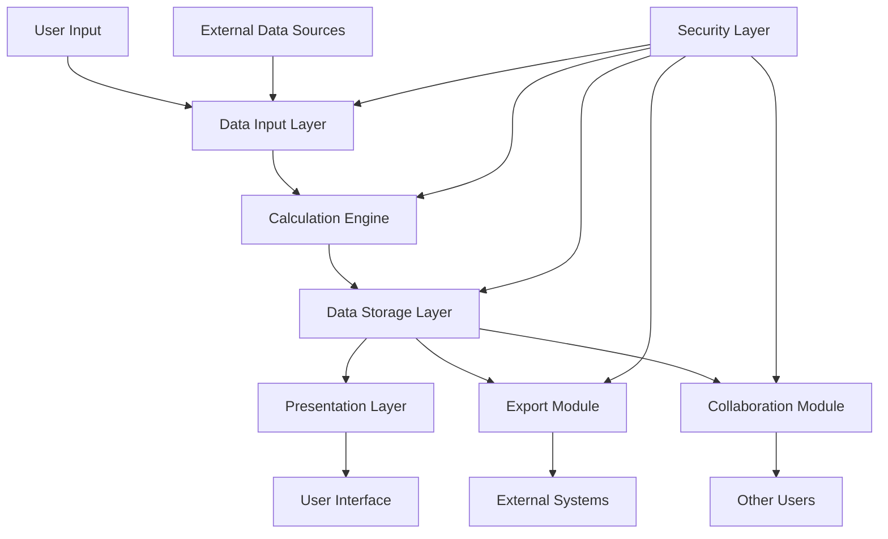

# INTRODUCTION

## PURPOSE

The purpose of this Software Requirements Specification (SRS) document is to provide a comprehensive and detailed description of the Microsoft Excel software application. This document serves as the primary reference for the development team, project managers, quality assurance testers, and other stakeholders involved in the creation and deployment of Microsoft Excel.

This SRS aims to:

1. Clearly define the functional and non-functional requirements of Microsoft Excel
2. Establish a shared understanding of the project scope and objectives among all stakeholders
3. Serve as a basis for project planning, cost estimation, and resource allocation
4. Provide a benchmark for validating the final product against the initial requirements
5. Act as a contractual agreement between the development team and Microsoft

The intended audience for this document includes:

- Software developers and engineers
- Project managers and team leads
- Quality assurance and testing teams
- User experience (UX) and user interface (UI) designers
- Microsoft executives and product managers
- Technical writers and documentation specialists
- Third-party integrators and add-in developers
- Legal and compliance teams

## SCOPE

Microsoft Excel is a powerful and versatile spreadsheet application designed to revolutionize data management, analysis, and visualization for individuals and businesses across various industries. As a cornerstone of the Microsoft Office suite, Excel aims to provide a comprehensive solution for organizing, manipulating, and deriving insights from structured data.

### Goals

1. Develop an intuitive and efficient interface for data input and manipulation
2. Implement a robust calculation engine capable of handling complex formulas and large datasets
3. Create advanced data visualization tools for effective communication of insights
4. Ensure seamless cross-platform functionality across desktop, web, and mobile devices
5. Facilitate collaboration and data sharing among users
6. Integrate with other Microsoft Office applications for a cohesive productivity ecosystem

### Benefits

1. Increased productivity through streamlined data management and analysis processes
2. Enhanced decision-making capabilities with powerful data visualization tools
3. Improved collaboration and information sharing within organizations
4. Reduced errors and increased accuracy in calculations and data processing
5. Flexibility to work across multiple devices and platforms
6. Scalability to handle projects of varying sizes and complexities

### Core Functionalities

1. Grid-based interface for data entry and manipulation
2. Comprehensive formula system with 400+ built-in functions
3. Advanced charting and graphing capabilities (50+ chart types)
4. Data analysis tools including pivot tables and what-if analysis
5. Cell, row, and column formatting options for improved readability
6. Sorting and filtering capabilities for efficient data organization
7. Support for multiple worksheets within a single workbook
8. Import and export functionality for various data formats
9. Macro recording and Visual Basic for Applications (VBA) support for automation
10. Real-time collaboration features with cloud integration
11. Cross-platform availability (Windows, macOS, web, iOS, and Android)

Microsoft Excel will be developed using a combination of C++, .NET technologies for desktop applications, and web technologies (HTML5, CSS3, JavaScript) for the online version. The mobile applications will be developed using native iOS (Swift) and Android (Kotlin) technologies. Cloud services will be implemented using Microsoft Azure to ensure seamless synchronization and collaboration features.

By delivering these core functionalities and adhering to the project goals, Microsoft Excel aims to maintain its position as the industry-leading spreadsheet application, catering to a wide range of users from beginners to advanced data analysts and financial professionals.

# PRODUCT DESCRIPTION

## PRODUCT PERSPECTIVE

Microsoft Excel is a core component of the Microsoft Office suite, designed to work seamlessly within the broader ecosystem of productivity tools. It serves as the primary spreadsheet application, complementing other Office applications such as Word, PowerPoint, and Access. Excel's position within this ecosystem allows for enhanced data integration and workflow efficiency across various business processes.

Key aspects of Excel's product perspective include:

1. Integration with Microsoft Office: Excel shares a common user interface design with other Office applications, ensuring a consistent user experience. It can embed and link data from other Office documents, facilitating comprehensive document creation and data management.

2. Cloud Connectivity: As part of Microsoft's cloud strategy, Excel integrates with OneDrive and SharePoint, enabling cloud-based storage, access, and real-time collaboration. This connectivity extends Excel's functionality beyond the desktop, allowing users to work across devices and locations seamlessly.

3. Cross-Platform Availability: Excel is designed to function across multiple platforms, including Windows, macOS, web browsers (Excel Online), and mobile devices (iOS and Android). This cross-platform approach ensures users can access and manipulate their data regardless of their preferred device or operating system.

4. Extensibility: Excel serves as a platform for third-party developers to create add-ins and extensions, expanding its functionality to meet specific industry or user needs. This extensibility positions Excel as a versatile tool adaptable to various business scenarios.

5. Data Ecosystem: Excel acts as a hub for data analysis and visualization within many organizations. It can import data from various sources, including databases, web services, and other file formats, positioning it as a central tool in the data management and analysis workflow.



## PRODUCT FUNCTIONS

Microsoft Excel provides a wide range of functions to support data management, analysis, and visualization. The main functions of the software include:

1. Data Entry and Management
   - Grid-based interface for structured data input
   - Support for various data types (numbers, text, dates, currencies)
   - Data validation and error checking
   - Sorting and filtering capabilities

2. Calculation and Formula Processing
   - Comprehensive formula system with 400+ built-in functions
   - Custom formula creation
   - Automatic recalculation of dependent cells
   - Array formulas for complex calculations

3. Data Analysis
   - Pivot Tables for data summarization and exploration
   - What-if analysis tools (Goal Seek, Scenario Manager)
   - Statistical analysis functions
   - Data modeling and forecasting capabilities

4. Data Visualization
   - Wide range of chart types (50+) for graphical data representation
   - Conditional formatting for visual data analysis
   - Sparklines for inline data visualization
   - Custom chart creation and modification

5. Collaboration and Sharing
   - Real-time co-authoring for simultaneous editing
   - Comments and review features
   - Sharing options with granular permissions
   - Version history and change tracking

6. Automation and Customization
   - Macro recording and editing
   - Visual Basic for Applications (VBA) support for custom solutions
   - User-defined functions and add-in development

7. Data Import and Export
   - Support for various file formats (CSV, XML, JSON, PDF)
   - Database connectivity (SQL, Access)
   - Web data retrieval and API integration

8. Reporting and Printing
   - Page layout and print area customization
   - Header and footer options
   - Print scaling and fit-to-page features

9. Security and Protection
   - Workbook and worksheet protection options
   - Data encryption capabilities
   - Digital signature support for macros

10. Mobile and Web Access
    - Responsive design for mobile device usage
    - Web-based editing through Excel Online
    - Syncing and cloud storage integration

## USER CHARACTERISTICS

Microsoft Excel caters to a diverse user base with varying levels of expertise and different use cases. Understanding these user characteristics is crucial for designing an application that meets the needs of all users. The main user groups include:

1. Novice Users
   - Characteristics: Limited experience with spreadsheets, may be intimidated by complex features
   - Needs: Intuitive interface, basic data entry and simple calculation functions, easy-to-use charting tools
   - Example Persona: Sarah, a small business owner who uses Excel for basic bookkeeping and expense tracking

2. Intermediate Users
   - Characteristics: Comfortable with basic Excel functions, looking to expand their skills
   - Needs: More advanced formulas, data analysis tools like pivot tables, improved data visualization options
   - Example Persona: Mark, a marketing analyst who uses Excel for campaign performance tracking and reporting

3. Advanced Users / Power Users
   - Characteristics: Highly proficient in Excel, often use complex functions and automation
   - Needs: Advanced statistical functions, macro capabilities, VBA for custom solutions, large dataset handling
   - Example Persona: Lisa, a financial analyst who develops complex financial models and automates reporting processes

4. Data Analysts
   - Characteristics: Focused on data manipulation, analysis, and visualization
   - Needs: Robust data import/export capabilities, advanced analytical functions, powerful charting tools
   - Example Persona: Alex, a business intelligence specialist who uses Excel for data exploration and dashboard creation

5. Managers and Executives
   - Characteristics: Need quick insights and summary views, may delegate detailed work
   - Needs: Easy-to-use reporting tools, clear data visualization, mobile access for on-the-go decision making
   - Example Persona: Jennifer, a sales director who uses Excel to review sales performance and forecast trends

6. Developers and IT Professionals
   - Characteristics: Create custom solutions and integrate Excel with other systems
   - Needs: Robust API, extensibility options, VBA and add-in development capabilities
   - Example Persona: Michael, an IT consultant who develops custom Excel solutions for clients

7. Educational Users
   - Characteristics: Using Excel for learning or teaching purposes
   - Needs: Clear documentation, tutorial features, education-specific templates
   - Example Persona: Professor Chen, who teaches data analysis courses using Excel

8. Collaborative Teams
   - Characteristics: Work together on shared documents, often across different locations
   - Needs: Real-time collaboration features, version control, commenting and review tools
   - Example Persona: The finance team at a multinational corporation, collaborating on budget forecasts

## CONSTRAINTS

1. Technical Constraints
   - Must maintain backwards compatibility with files created in previous Excel versions
   - Performance limitations when handling extremely large datasets (e.g., over 1 million rows)
   - Mobile versions may have reduced functionality due to device limitations
   - Must adhere to Microsoft's existing technology stack and development frameworks

2. Regulatory Constraints
   - Compliance with data protection regulations (e.g., GDPR, CCPA) for handling user data
   - Adherence to accessibility standards (e.g., WCAG 2.1) for users with disabilities
   - Compliance with industry-specific regulations for financial calculations and reporting

3. Business Constraints
   - Must align with Microsoft's pricing and licensing models for Office products
   - Features should not cannibalize other Microsoft products or services
   - Development timeline must align with the broader Office suite release schedule

4. User Interface Constraints
   - Must maintain consistency with the Microsoft Office ribbon interface
   - Limited screen real estate on mobile devices restricts UI design options
   - Need to balance feature-rich environment with user-friendly interface for novice users

5. Operational Constraints
   - Cloud-based features dependent on Microsoft's server infrastructure and uptime
   - Regular update cycles may impact user workflows and require additional training

6. Security Constraints
   - Must implement robust security measures to protect sensitive user data
   - Macro and VBA features need to be balanced with potential security risks

7. Localization Constraints
   - Must support multiple languages and regional settings (numbers, dates, currencies)
   - Formulas and functions need to work consistently across different locales

8. Performance Constraints
   - Calculations and file operations must complete within acceptable time frames (e.g., <1 second for most operations)
   - Memory usage must be optimized to prevent crashes on systems with limited resources

9. Compatibility Constraints
   - Must ensure cross-platform consistency in feature availability and file fidelity
   - Need to support integration with a wide range of third-party applications and services

10. Legal Constraints
    - Must respect existing patents and intellectual property rights in spreadsheet technology
    - Licensing agreements for any third-party components used in development

## ASSUMPTIONS AND DEPENDENCIES

### Assumptions

1. Users have basic computer literacy and familiarity with spreadsheet concepts
2. The majority of users have reliable internet connectivity for cloud-based features
3. Microsoft's cloud infrastructure can handle the expected user load and data storage requirements
4. The existing Microsoft Office codebase is well-documented and maintainable
5. Users are willing to upgrade their hardware and software to meet minimum system requirements
6. The market demand for spreadsheet software will remain strong throughout the development and release cycle
7. The core Excel file format will remain stable, with only minor extensions needed for new features
8. Mobile device capabilities will continue to improve, allowing for more advanced features on these platforms
9. Users are increasingly interested in collaborative and cloud-based workflows
10. The development team has the necessary skills and resources to implement all planned features

### Dependencies

1. Microsoft Office Suite: Excel must integrate seamlessly with other Office applications and share common components
2. Operating Systems: Dependent on Windows and macOS for desktop versions, iOS and Android for mobile versions
3. Web Browsers: Excel Online relies on modern web browsers and their support for required web technologies
4. Microsoft Azure: Cloud services and infrastructure for online collaboration and storage features
5. Third-party Libraries: Various external libraries and components for specific functionalities (e.g., charting, data connections)
6. Development Tools: Visual Studio, .NET Framework, and other Microsoft development technologies
7. Testing Frameworks: Automated testing tools and environments for ensuring product quality
8. Localization Services: Translation and cultural adaptation services for supporting multiple languages
9. Microsoft Update Services: For distributing software updates and patches to users
10. App Stores: Reliance on Microsoft Store, Apple App Store, and Google Play Store for distribution of mobile and desktop applications
11. Microsoft Account System: For user authentication and license management
12. Office 365 Subscription Model: For certain advanced features and cloud services
13. Data Providers: APIs and services for financial data, currency conversion, and other external data sources
14. Accessibility Tools: Screen readers and other assistive technologies for ensuring accessibility compliance
15. Security Infrastructure: Microsoft's security protocols and systems for data protection and encryption



These assumptions and dependencies form the foundation upon which the Microsoft Excel project is built. Regular assessment and validation of these factors throughout the development process will be crucial to ensure project success and mitigate potential risks.

Here's a PROCESS FLOWCHART section for the Microsoft Excel Software Requirements Specification (SRS) using Mermaid JS:

## PROCESS FLOWCHART

The following flowchart illustrates the high-level process flow for the core functionality of Microsoft Excel:



This flowchart represents the basic user interaction flow within Microsoft Excel, including:

1. Starting Excel and choosing between creating a new workbook or opening an existing file.
2. Displaying the grid interface where users can perform various actions.
3. Main user actions such as data entry, formula input, formatting, chart creation, and saving.
4. The data processing subgraph, showing how changes in data or formulas trigger recalculations and updates.
5. The option to perform more actions or close Excel.

The flowchart aligns with the previously mentioned features and functionalities of Microsoft Excel, including the grid-based interface, formula system, formatting options, and charting capabilities. It also reflects the software's ability to handle real-time updates and calculations, which is crucial for maintaining data integrity and providing immediate feedback to users.

This high-level process flow serves as a foundation for more detailed flowcharts that can be developed for specific features or modules within Excel, such as the formula calculation engine, chart creation process, or data import/export functionalities.

Here's a breakdown of Microsoft Excel's features with the requested sub-sections:

1. Grid Interface

ID: F001
DESCRIPTION: The core spreadsheet interface with cells organized in rows and columns, allowing for data input and manipulation.
PRIORITY: High

| Requirement ID | Requirement Description |
|----------------|--------------------------|
| F001-1 | Support for at least 1,048,576 rows by 16,384 columns |
| F001-2 | Cell merging and splitting capabilities |
| F001-3 | Freeze panes functionality for easier navigation of large datasets |
| F001-4 | Auto-fill and flash fill for quick data entry |
| F001-5 | Multiple worksheet support within a single workbook |

2. Formula System

ID: F002
DESCRIPTION: A comprehensive set of built-in functions and the ability to create custom formulas for data calculation and analysis.
PRIORITY: High

| Requirement ID | Requirement Description |
|----------------|--------------------------|
| F002-1 | Support for at least 400 built-in functions across various categories |
| F002-2 | Ability to create and use custom functions |
| F002-3 | Formula autocomplete and syntax checking |
| F002-4 | Support for array formulas and dynamic arrays |
| F002-5 | Formula auditing tools (e.g., trace precedents/dependents) |

3. Data Visualization

ID: F003
DESCRIPTION: Tools for creating charts, graphs, and other visual representations of data.
PRIORITY: High

| Requirement ID | Requirement Description |
|----------------|--------------------------|
| F003-1 | Support for at least 50 different chart types |
| F003-2 | Customizable chart elements (colors, fonts, labels, etc.) |
| F003-3 | Dynamic chart updates when source data changes |
| F003-4 | Sparklines for inline data visualization |
| F003-5 | Conditional formatting with data bars, color scales, and icon sets |

4. Data Analysis Tools

ID: F004
DESCRIPTION: Advanced features for analyzing and summarizing large datasets.
PRIORITY: Medium

| Requirement ID | Requirement Description |
|----------------|--------------------------|
| F004-1 | Pivot Table functionality for data summarization |
| F004-2 | What-if analysis tools (Goal Seek, Scenario Manager) |
| F004-3 | Data validation to control input types |
| F004-4 | Sorting and filtering capabilities |
| F004-5 | Descriptive statistics functions |

5. Collaboration Features

ID: F005
DESCRIPTION: Tools that enable multiple users to work on the same spreadsheet simultaneously.
PRIORITY: Medium

| Requirement ID | Requirement Description |
|----------------|--------------------------|
| F005-1 | Real-time co-authoring with user presence indicators |
| F005-2 | Comments and threaded discussions |
| F005-3 | Version history and restore capabilities |
| F005-4 | Sharing options with granular permissions |
| F005-5 | Integration with Microsoft Teams for enhanced collaboration |

6. Automation and Extensibility

ID: F006
DESCRIPTION: Features that allow users to automate tasks and extend Excel's functionality.
PRIORITY: Medium

| Requirement ID | Requirement Description |
|----------------|--------------------------|
| F006-1 | Macro recording and editing capabilities |
| F006-2 | Support for Visual Basic for Applications (VBA) |
| F006-3 | Add-in development framework |
| F006-4 | Integration with Power Query for advanced data import and transformation |
| F006-5 | Support for Office JavaScript API for web add-ins |

7. Cross-Platform Functionality

ID: F007
DESCRIPTION: Consistent functionality across different operating systems and devices.
PRIORITY: High

| Requirement ID | Requirement Description |
|----------------|--------------------------|
| F007-1 | Full-featured desktop applications for Windows and macOS |
| F007-2 | Web-based version (Excel Online) with core functionality |
| F007-3 | Mobile applications for iOS and Android |
| F007-4 | Consistent user interface across all platforms |
| F007-5 | Seamless file compatibility between platforms |

8. Data Import/Export

ID: F008
DESCRIPTION: Capabilities to import data from various sources and export Excel data to different formats.
PRIORITY: Medium

| Requirement ID | Requirement Description |
|----------------|--------------------------|
| F008-1 | Support for importing CSV, XML, JSON, and PDF files |
| F008-2 | Direct connection to external databases (e.g., SQL, Access) |
| F008-3 | Web data retrieval through Power Query |
| F008-4 | Export options including PDF, CSV, and XML |
| F008-5 | Integration with Power BI for advanced data publishing |

9. Security and Protection

ID: F009
DESCRIPTION: Features to ensure data security and protect intellectual property.
PRIORITY: High

| Requirement ID | Requirement Description |
|----------------|--------------------------|
| F009-1 | Workbook and worksheet protection options |
| F009-2 | Data encryption for sensitive information |
| F009-3 | Digital signature support for macros and add-ins |
| F009-4 | Information Rights Management (IRM) integration |
| F009-5 | Compliance with data protection regulations (e.g., GDPR, CCPA) |

10. Cloud Integration

ID: F010
DESCRIPTION: Seamless integration with cloud services for storage, syncing, and enhanced functionality.
PRIORITY: High

| Requirement ID | Requirement Description |
|----------------|--------------------------|
| F010-1 | OneDrive integration for cloud storage and syncing |
| F010-2 | Automatic saving and version history in the cloud |
| F010-3 | Integration with Microsoft Graph API for enhanced Office 365 functionality |
| F010-4 | Support for Excel Online co-authoring |
| F010-5 | Cloud-based Excel functions (e.g., STOCKHISTORY, UNIQUE) |

These features align with the previously mentioned technology and framework choices, including C++, .NET technologies for desktop applications, web technologies (HTML5, CSS3, JavaScript) for the online version, and native iOS (Swift) and Android (Kotlin) technologies for mobile applications. The cloud services are implemented using Microsoft Azure to ensure seamless synchronization and collaboration features.

# NON-FUNCTIONAL REQUIREMENTS

## PERFORMANCE

1. Response Time
   - Excel shall load files up to 100MB in size within 5 seconds on standard hardware configurations.
   - Formula calculations shall complete within 1 second for workbooks with up to 1 million cells.
   - Chart rendering shall occur within 2 seconds for datasets up to 100,000 data points.

2. Throughput
   - Excel shall support concurrent editing by up to 100 users on a single workbook without degradation in performance.
   - The application shall handle bulk operations (e.g., paste, fill) on up to 100,000 cells within 3 seconds.

3. Resource Usage
   - Excel desktop application shall not consume more than 2GB of RAM during normal operation.
   - CPU usage shall not exceed 30% for routine operations on standard hardware.
   - Excel Online shall be optimized to run efficiently on browsers with a minimum of 4GB RAM.

## SAFETY

1. Data Protection
   - Excel shall automatically save user data every 5 minutes to prevent data loss in case of application or system failure.
   - In the event of an unexpected shutdown, Excel shall provide a recovery mechanism to restore unsaved changes upon next launch.

2. Error Handling
   - Excel shall gracefully handle and log errors without crashing the application.
   - Critical errors shall be reported to Microsoft for analysis and improvement.

3. Backup and Recovery
   - Excel shall maintain a version history of documents stored in the cloud, allowing users to revert to previous versions.
   - Local backups of open documents shall be created every 10 minutes to mitigate data loss from hardware failures.

## SECURITY

1. Authentication
   - Excel shall support multi-factor authentication for Microsoft account logins.
   - Integration with Azure Active Directory for enterprise user authentication.

2. Authorization
   - Implementation of role-based access control for shared workbooks.
   - Support for granular permissions on cell ranges, sheets, and workbook elements.

3. Data Encryption
   - All data transmitted between client and server shall be encrypted using TLS 1.3 or higher.
   - Support for at-rest encryption of local and cloud-stored files using AES-256 encryption.

4. Privacy
   - Compliance with GDPR, CCPA, and other relevant data protection regulations.
   - User data shall be anonymized for any telemetry or crash reporting features.

## QUALITY

1. Availability
   - Excel Online shall maintain 99.9% uptime, measured on a monthly basis.
   - Scheduled maintenance shall not exceed 4 hours per month and shall be performed during off-peak hours.

2. Maintainability
   - The codebase shall adhere to Microsoft's coding standards and best practices.
   - Modular architecture to allow for easy updates and feature additions.
   - Comprehensive documentation of code and APIs to facilitate maintenance.

3. Usability
   - Excel shall maintain a consistent user interface across all platforms (desktop, web, mobile).
   - The application shall be accessible, complying with WCAG 2.1 Level AA standards.
   - User interface shall be localized in at least 25 languages.

4. Scalability
   - Excel shall support workbooks with up to 1,048,576 rows by 16,384 columns.
   - The application architecture shall allow for easy addition of new features and scaling of existing ones.
   - Cloud infrastructure shall automatically scale to handle increased user load during peak times.

5. Reliability
   - Mean Time Between Failures (MTBF) shall be at least 720 hours of operation.
   - Excel shall have a maximum of 1 critical bug per 10,000 lines of code.
   - Automated testing shall cover at least 90% of the codebase.

## COMPLIANCE

1. Legal Compliance
   - Excel shall comply with all relevant intellectual property laws and licensing agreements.
   - The software shall adhere to the terms of the Microsoft Software License Agreement.

2. Regulatory Compliance
   - Compliance with data protection regulations including GDPR, CCPA, and HIPAA where applicable.
   - Adherence to financial regulations such as Sarbanes-Oxley Act for relevant financial functions.

3. Standards Compliance
   - Excel shall conform to ISO/IEC 29500 standards for Office Open XML file formats.
   - Compliance with ISO 27001 for information security management.
   - Adherence to W3C standards for web-based components.

4. Accessibility Compliance
   - Compliance with Section 508 of the Rehabilitation Act for federal agencies in the United States.
   - Adherence to EN 301 549 accessibility requirements for public sector bodies in the European Union.

5. Industry-Specific Compliance
   - Support for GxP compliance features for use in regulated industries (e.g., pharmaceuticals).
   - Compliance with FISMA requirements for use in U.S. government agencies.

These non-functional requirements align with the previously mentioned technology choices, including C++, .NET technologies for desktop applications, web technologies (HTML5, CSS3, JavaScript) for the online version, and native iOS (Swift) and Android (Kotlin) technologies for mobile applications. The cloud services implemented using Microsoft Azure will be leveraged to meet many of the performance, security, and scalability requirements.

# DATA REQUIREMENTS

## DATA MODELS

Microsoft Excel handles various types of data structures to support its wide range of functionalities. The primary data models include:

1. Workbook
2. Worksheet
3. Cell
4. Range
5. Chart
6. PivotTable
7. Macro
8. User

The following entity-relationship diagram illustrates the relationships between these key data models:



## DATA STORAGE

Microsoft Excel employs a robust data storage strategy to ensure data integrity, availability, and security across its various platforms.

1. File Formats:
   - Primary format: .xlsx (Office Open XML)
   - Legacy support: .xls (Binary Excel File)
   - Macro-enabled: .xlsm
   - Template: .xltx

2. Local Storage:
   - Desktop versions (Windows and macOS) store files locally on the user's hard drive
   - Automatic save feature creates temporary files to prevent data loss

3. Cloud Storage:
   - Integration with Microsoft OneDrive for cloud-based storage
   - Support for SharePoint for enterprise-level document management

4. Database Backend:
   - Azure SQL Database for storing user account information, preferences, and metadata
   - Azure Cosmos DB for storing real-time collaboration data and version history

5. Data Retention:
   - Local files: Retained until deleted by the user
   - Cloud files: Retained according to the user's OneDrive or SharePoint settings
   - Version history: Last 100 versions or 30 days, whichever is greater

6. Redundancy and Backup:
   - Cloud data: Geo-redundant storage with automatic backups
   - Local data: Encouragement of user-initiated backups through prompts and education

7. Recovery:
   - Autosave feature for recovering unsaved changes
   - Version history for reverting to previous states of the document
   - Deleted file recovery from OneDrive Recycle Bin (up to 30 days)

8. Scalability:
   - Use of Azure Blob Storage for handling large volumes of user data
   - Elastic scaling of Azure SQL Database to accommodate growing user base

## DATA PROCESSING

Microsoft Excel processes data through various operations, ensuring security and efficiency throughout the data lifecycle.

1. Data Input:
   - Manual entry through the user interface
   - Import from external sources (CSV, XML, databases)
   - Real-time data feeds (e.g., stock market data)

2. Calculation Engine:
   - Multi-threaded processing for complex calculations
   - Dependency tracking for efficient recalculation of affected cells

3. Data Transformation:
   - Built-in functions for data manipulation
   - Power Query for advanced ETL operations

4. Data Analysis:
   - PivotTables for data summarization and exploration
   - Data analysis tools (e.g., Goal Seek, Solver)

5. Data Visualization:
   - Chart generation based on selected data ranges
   - Conditional formatting for visual data analysis

6. Data Export:
   - Support for various export formats (CSV, PDF, XML)
   - API access for programmatic data extraction

7. Collaboration:
   - Real-time co-authoring with conflict resolution
   - Change tracking and version control

8. Data Security:
   - Encryption at rest using AES 256-bit encryption
   - Encryption in transit using TLS 1.2 or higher
   - Role-based access control for shared workbooks
   - Data Loss Prevention (DLP) policies integration
   - Multi-factor authentication for user access

The following data flow diagram illustrates the high-level data processing within Microsoft Excel:



This data flow ensures that all data processing operations are subject to the security layer, maintaining data integrity and confidentiality throughout the system. The modular architecture allows for efficient data handling and processing, supporting Excel's diverse range of features while maintaining performance and scalability.

# EXTERNAL INTERFACES

## USER INTERFACES

Microsoft Excel will provide a consistent and intuitive user interface across all supported platforms, adhering to Microsoft's design guidelines and accessibility standards. The user interface will be designed to accommodate both novice and advanced users, with a focus on discoverability and efficiency.

Key UI components include:

1. Ribbon Interface: A tabbed ribbon toolbar providing easy access to features and commands, organized by functional categories.

2. Quick Access Toolbar: Customizable toolbar for frequently used commands.

3. Formula Bar: For viewing and editing cell contents and formulas.

4. Worksheet Grid: The main area for data entry and visualization.

5. Sheet Tabs: For navigating between multiple worksheets within a workbook.

6. Status Bar: Displaying relevant information and quick calculations.

7. Contextual Menus: Right-click menus providing context-specific options.

8. Dialog Boxes: For advanced feature configuration and options.

9. Sidebar Panels: For additional functionality like formatting, chart customization, and pivot table fields.

Placeholder for UI Mockups:
```
[Insert high-fidelity mockups of key UI components here]
```

Accessibility considerations:
- Support for high contrast modes
- Keyboard navigation for all features
- Screen reader compatibility
- Customizable font sizes and color schemes

The UI will be responsive, adapting to different screen sizes and orientations for the web and mobile versions of Excel.

## HARDWARE INTERFACES

While Microsoft Excel is primarily a software application, it interacts with various hardware components to enhance user experience and functionality:

1. Input Devices:
   - Keyboard: For data entry and navigation
   - Mouse/Trackpad: For selection, navigation, and interaction with UI elements
   - Touch Screen: For touch-based input on compatible devices
   - Stylus: For precise input on touch-enabled devices

2. Display:
   - Support for various screen resolutions and aspect ratios
   - Multi-monitor support for extended workspace

3. Storage Devices:
   - Hard Disk Drives (HDD) and Solid State Drives (SSD) for file storage and retrieval
   - Support for external storage devices (USB drives, external hard drives)

4. Printers:
   - Interface with local and network printers for document output
   - Support for various paper sizes and orientations

5. Cameras:
   - Integration with device cameras for scanning documents or QR codes

6. Biometric Sensors:
   - Support for fingerprint readers or facial recognition for secure login (where available)

Excel will utilize standard device drivers and APIs provided by the operating system to interact with these hardware components, ensuring broad compatibility and minimal configuration requirements for users.

## SOFTWARE INTERFACES

Microsoft Excel will interact with various software systems and components to provide a comprehensive and integrated user experience:

1. Operating Systems:
   - Windows: Compatible with Windows 10 and later versions
   - macOS: Compatible with macOS 10.14 (Mojave) and later versions
   - iOS: Compatible with iOS 13 and later versions
   - Android: Compatible with Android 8.0 (Oreo) and later versions

2. Web Browsers (for Excel Online):
   - Microsoft Edge (Chromium-based)
   - Google Chrome
   - Mozilla Firefox
   - Apple Safari

3. Microsoft Office Suite Integration:
   - Word: For embedding Excel tables and charts in documents
   - PowerPoint: For embedding Excel data in presentations
   - Outlook: For attaching and previewing Excel files in emails
   - Access: For importing/exporting data between Excel and Access databases

4. Cloud Services:
   - OneDrive: For file storage, syncing, and sharing
   - SharePoint: For enterprise-level document management and collaboration

5. Database Systems:
   - Microsoft SQL Server
   - MySQL
   - Oracle Database
   - PostgreSQL

6. External Data Sources:
   - Web services and APIs for data retrieval (e.g., financial data, weather information)
   - CSV, XML, and JSON file formats for data import/export

7. Add-in Ecosystem:
   - Support for third-party add-ins and extensions
   - Integration with Microsoft AppSource for add-in discovery and installation

8. Development Tools:
   - Visual Studio: For developing Excel add-ins and VBA macros
   - Visual Studio Code: For web add-in development

9. Version Control Systems:
   - Integration with Git for version control of Excel files (primarily for developer use)

10. Authentication Systems:
    - Microsoft Account
    - Azure Active Directory
    - Support for Single Sign-On (SSO) systems

Excel will use standard APIs, protocols, and file formats to ensure smooth integration with these software interfaces. Regular updates will be provided to maintain compatibility with the latest versions of interfacing software.

## COMMUNICATION INTERFACES

Microsoft Excel will utilize various communication interfaces to enable data exchange, collaboration, and integration with external systems:

1. Network Protocols:
   - HTTP/HTTPS: For web-based communication and API interactions
   - WebSocket: For real-time collaboration features
   - FTP/SFTP: For file transfer operations

2. Web Services:
   - RESTful APIs: For integration with external data sources and services
   - SOAP: For compatibility with legacy systems and certain enterprise services

3. Data Formats:
   - JSON: Primary format for data exchange in web services
   - XML: Alternative format for data exchange, especially with legacy systems
   - CSV: For simple data import/export operations

4. Cloud Communication:
   - Microsoft Graph API: For integration with Office 365 services
   - Azure Storage API: For cloud-based file storage and retrieval

5. Database Connectivity:
   - ODBC (Open Database Connectivity): For connecting to various database systems
   - ADO.NET: For database operations in .NET-based components

6. Real-time Collaboration:
   - Microsoft Fluid Framework: For enabling real-time co-authoring features

7. Email Protocols:
   - SMTP: For sending emails directly from Excel (e.g., sharing spreadsheets)
   - IMAP/POP3: For receiving data via email (if implemented)

8. Authentication Protocols:
   - OAuth 2.0: For secure authentication with Microsoft services and third-party APIs
   - SAML: For enterprise single sign-on scenarios

9. Encryption:
   - TLS 1.3: For securing all network communications
   - AES-256: For encrypting stored data and files

10. Synchronization:
    - Microsoft Sync Framework: For ensuring data consistency across devices

11. Push Notifications:
    - Windows Push Notification Services (WNS): For desktop notifications
    - Apple Push Notification Service (APNs): For iOS notifications
    - Firebase Cloud Messaging (FCM): For Android notifications

12. Printing:
    - IPP (Internet Printing Protocol): For network printing capabilities

13. Bluetooth:
    - Bluetooth Low Energy (BLE): For potential future features involving nearby device interaction

Excel will implement these communication interfaces using industry-standard libraries and frameworks, ensuring security, reliability, and performance. All communication will be encrypted where applicable, and best practices for data protection and privacy will be followed.

The software will be designed with a modular architecture to allow for easy updates and additions to communication interfaces as new technologies and standards emerge.

# APPENDICES

## GLOSSARY

- **Add-in**: A supplemental program that adds custom commands or features to Microsoft Excel.
- **Cell**: The intersection of a row and column in a spreadsheet where data can be entered.
- **Formula**: An expression that calculates the value of a cell.
- **Macro**: A recorded sequence of commands or keyboard strokes that can be played back to automate tasks.
- **Pivot Table**: A data summarization tool that automatically sorts, counts, and totals the data stored in a spreadsheet.
- **Range**: A collection of two or more cells in a worksheet.
- **Ribbon**: The strip of buttons and icons located at the top of the Excel window that allows users to access various Excel commands.
- **Sparkline**: A small chart in a worksheet cell that provides a visual representation of data.
- **VBA**: Visual Basic for Applications, a programming language used to develop Excel macros.
- **Workbook**: An Excel file that contains one or more worksheets.
- **Worksheet**: A single spreadsheet within an Excel workbook.

## ACRONYMS

- **API**: Application Programming Interface
- **CCPA**: California Consumer Privacy Act
- **CSV**: Comma-Separated Values
- **ETL**: Extract, Transform, Load
- **GDPR**: General Data Protection Regulation
- **GUI**: Graphical User Interface
- **HIPAA**: Health Insurance Portability and Accountability Act
- **HTML**: Hypertext Markup Language
- **HTTP**: Hypertext Transfer Protocol
- **HTTPS**: Hypertext Transfer Protocol Secure
- **JSON**: JavaScript Object Notation
- **ODBC**: Open Database Connectivity
- **PDF**: Portable Document Format
- **REST**: Representational State Transfer
- **SDK**: Software Development Kit
- **SOAP**: Simple Object Access Protocol
- **SQL**: Structured Query Language
- **SSL**: Secure Sockets Layer
- **TLS**: Transport Layer Security
- **UI**: User Interface
- **UX**: User Experience
- **VBA**: Visual Basic for Applications
- **XML**: Extensible Markup Language

## ADDITIONAL REFERENCES

1. Microsoft Office Development Documentation:
   https://docs.microsoft.com/en-us/office/dev/add-ins/

2. Excel JavaScript API Reference:
   https://docs.microsoft.com/en-us/javascript/api/excel

3. Microsoft Graph API Documentation:
   https://docs.microsoft.com/en-us/graph/

4. Azure SDK for .NET Documentation:
   https://docs.microsoft.com/en-us/dotnet/azure/

5. W3C Web Standards:
   https://www.w3.org/standards/

6. iOS Developer Documentation:
   https://developer.apple.com/documentation/

7. Android Developer Documentation:
   https://developer.android.com/docs

8. WCAG 2.1 Accessibility Guidelines:
   https://www.w3.org/TR/WCAG21/

9. OWASP Security Practices:
   https://owasp.org/www-project-top-ten/

10. Microsoft Learn - Excel Training:
    https://docs.microsoft.com/en-us/learn/paths/excel-fundamentals/

These additional references provide valuable resources for developers, designers, and other team members working on the Microsoft Excel project. They offer detailed technical documentation, best practices, and guidelines that align with the technology and framework choices outlined in the SRS document.