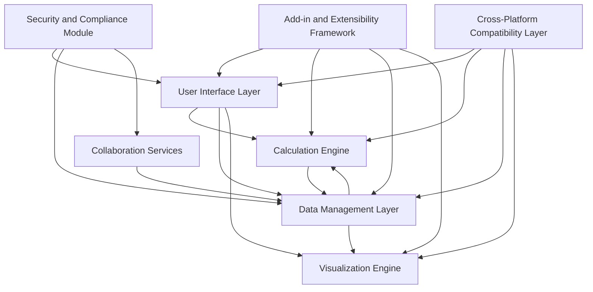
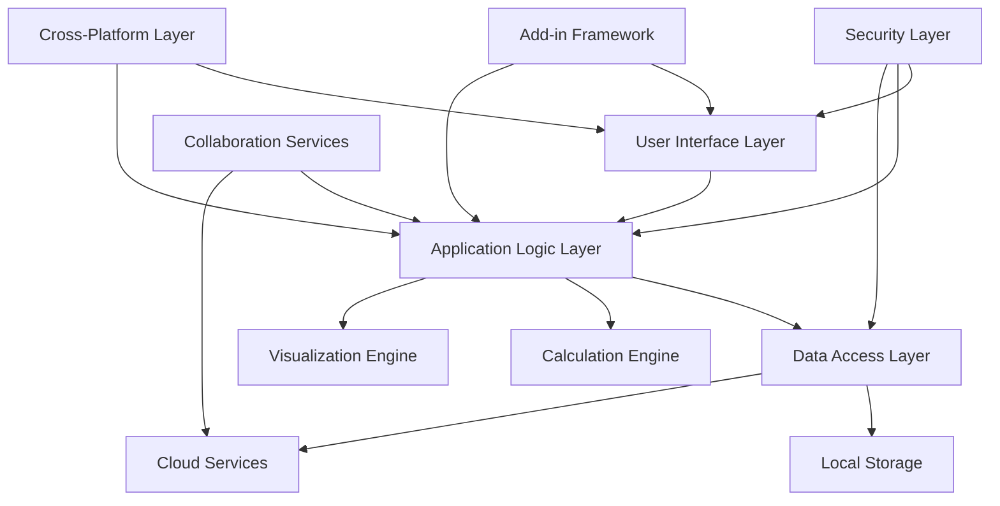
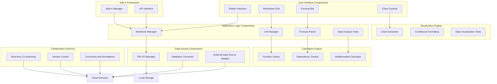
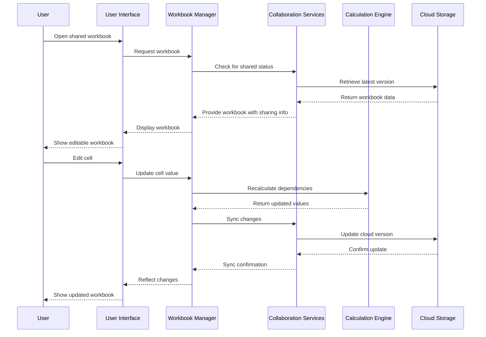
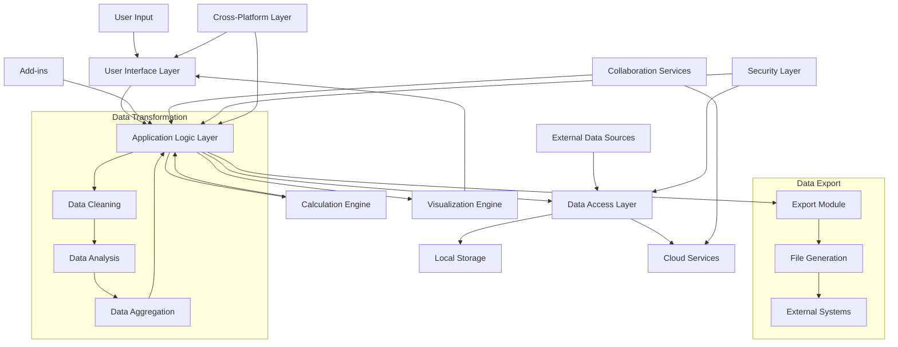
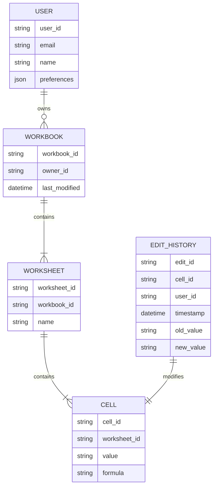
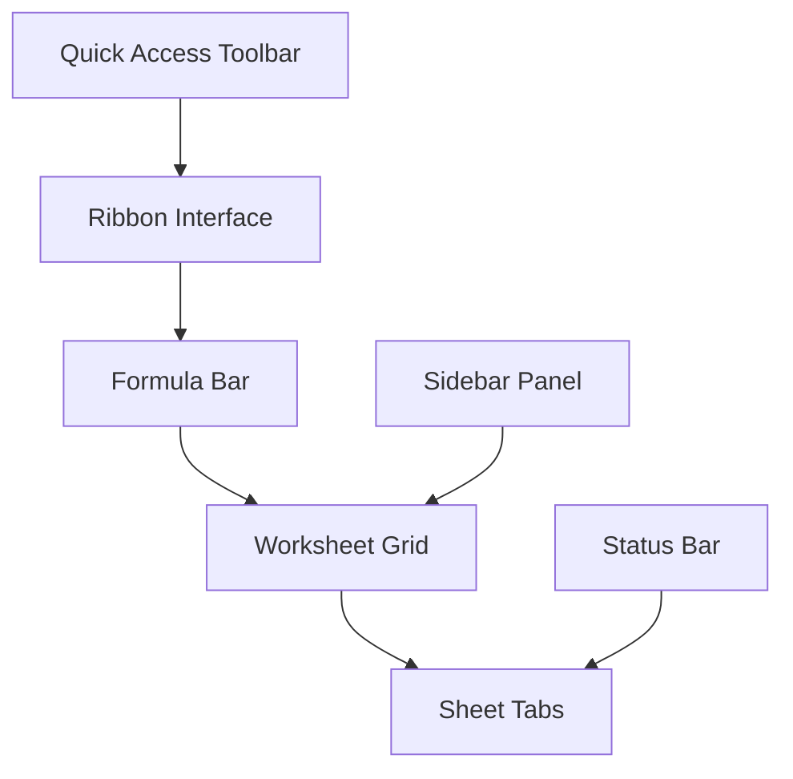
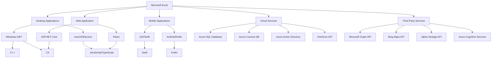
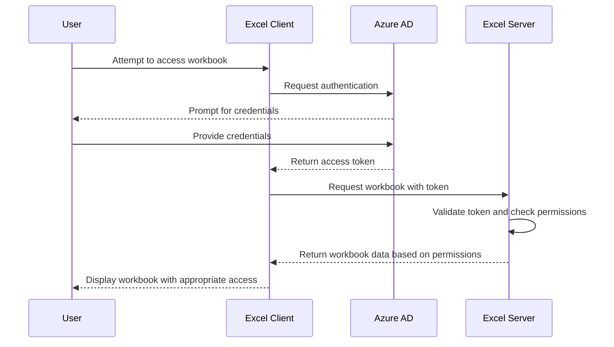

# INTRODUCTION

## SYSTEM OVERVIEW

Microsoft Excel is a comprehensive spreadsheet application designed to provide users with powerful tools for data management, analysis, and visualization. As a core component of the Microsoft Office suite, Excel offers a wide range of features catering to diverse user needs, from basic data entry to complex financial modeling and business intelligence.

The system architecture of Microsoft Excel can be divided into several key components:

1. User Interface Layer
2. Calculation Engine
3. Data Management Layer
4. Visualization Engine
5. Collaboration Services
6. Add-in and Extensibility Framework
7. Cross-Platform Compatibility Layer
8. Security and Compliance Module

The following diagram illustrates the high-level system architecture:



Key Features:

1. Grid-based interface for data input and manipulation
2. Comprehensive formula system with 400+ built-in functions
3. Advanced charting and data visualization capabilities
4. Pivot Tables and data analysis tools
5. Real-time collaboration and cloud integration
6. Macro recording and VBA support for automation
7. Cross-platform availability (Windows, macOS, web, iOS, and Android)
8. Extensibility through add-ins and APIs

Technology Stack:

- Desktop Applications: C++ and .NET technologies
- Web Version: HTML5, CSS3, JavaScript
- Mobile Applications: Swift (iOS) and Kotlin (Android)
- Cloud Services: Microsoft Azure

The system is designed to be scalable, maintainable, and extensible, with a focus on performance and user experience across all supported platforms. It integrates seamlessly with other Microsoft Office applications and cloud services, providing a comprehensive productivity ecosystem for users.

Excel's architecture allows for continuous improvement and feature additions while maintaining backwards compatibility with existing files and user workflows. The modular design facilitates easier updates and maintenance, ensuring that Excel can adapt to evolving user needs and technological advancements.

# SYSTEM ARCHITECTURE

## PROGRAMMING LANGUAGES

Microsoft Excel utilizes a variety of programming languages to support its diverse functionality across multiple platforms. The following table lists the primary programming languages used in the project and their justifications:

| Language | Purpose | Justification |
|----------|---------|---------------|
| C++ | Core calculation engine, performance-critical components | High performance, low-level control, legacy codebase compatibility |
| C# | Windows desktop application, .NET components | Robust Windows integration, strong typing, extensive .NET libraries |
| Swift | iOS application | Native iOS development, performance, and user experience |
| Kotlin | Android application | Modern Android development, interoperability with Java |
| JavaScript | Web version (Excel Online), Office Add-ins | Cross-browser compatibility, rich ecosystem for web development |
| TypeScript | Large-scale JavaScript development | Enhanced tooling, static typing for improved maintainability |
| Python | Data analysis features, machine learning integration | Rich data science libraries, ease of integration with external tools |
| VBA | Macro programming, backwards compatibility | User-created macros, legacy support |
| SQL | Database queries and management | Efficient data retrieval and manipulation for large datasets |

## HIGH-LEVEL ARCHITECTURE DIAGRAM

The following diagram provides an overview of Microsoft Excel's high-level architecture, showing the main components and their interactions:



## COMPONENT DIAGRAMS

The following diagram details the specific components within the Microsoft Excel system:



## SEQUENCE DIAGRAMS

The following sequence diagram illustrates the process of opening and editing a shared workbook in Microsoft Excel:



## DATA-FLOW DIAGRAM

The following diagram illustrates how data flows through the Microsoft Excel system:



This data-flow diagram shows how information moves through the Microsoft Excel system, from user input through various processing stages to storage and output. It highlights the central role of the Application Logic Layer in coordinating data flow between different components, including the Calculation Engine, Visualization Engine, and Data Access Layer. The diagram also illustrates how data is transformed within the system and how it can be exported to external systems.

# SYSTEM DESIGN

## PROGRAMMING LANGUAGES

Microsoft Excel utilizes a variety of programming languages to support its diverse functionality across multiple platforms. The following table lists the primary programming languages used in the project and their justifications:

| Language | Purpose | Justification |
|----------|---------|---------------|
| C++ | Core calculation engine, performance-critical components | High performance, low-level control, legacy codebase compatibility |
| C# | Windows desktop application, .NET components | Robust Windows integration, strong typing, extensive .NET libraries |
| Swift | iOS application | Native iOS development, performance, and user experience |
| Kotlin | Android application | Modern Android development, interoperability with Java |
| JavaScript | Web version (Excel Online), Office Add-ins | Cross-browser compatibility, rich ecosystem for web development |
| TypeScript | Large-scale JavaScript development | Enhanced tooling, static typing for improved maintainability |
| Python | Data analysis features, machine learning integration | Rich data science libraries, ease of integration with external tools |
| VBA | Macro programming, backwards compatibility | User-created macros, legacy support |
| SQL | Database queries and management | Efficient data retrieval and manipulation for large datasets |

## DATABASE DESIGN

Microsoft Excel primarily uses file-based storage for individual workbooks, but it also relies on databases for certain features and services. The database design includes:

1. User Account Database (Azure SQL Database):
   - Stores user profile information, preferences, and subscription details
   - Enables quick user authentication and personalization across devices

2. Collaboration Database (Azure Cosmos DB):
   - Manages real-time collaboration data, including user presence and edit history
   - Provides low-latency access for concurrent editing features

3. Template and Add-in Database (Azure SQL Database):
   - Stores metadata for Excel templates and add-ins
   - Facilitates discovery and installation of extensions

4. Telemetry Database (Azure Data Lake):
   - Collects anonymized usage data for feature improvement and bug tracking
   - Supports big data analytics for product development insights

Here's a simplified entity-relationship diagram for the User Account and Collaboration databases:



## API DESIGN

Microsoft Excel's API design facilitates communication between different components of the system and enables integration with external services. The API architecture includes:

1. Excel JavaScript API:
   - Enables web add-ins to interact with Excel objects and data
   - RESTful design for easy consumption by web developers

2. Microsoft Graph API:
   - Provides unified access to Microsoft 365 services, including Excel
   - Enables reading and writing Excel data from external applications

3. VBA API:
   - Allows automation and custom functionality within Excel
   - Maintains backwards compatibility with existing macros

4. Excel REST API:
   - Enables programmatic access to Excel workbooks stored in OneDrive or SharePoint
   - Supports CRUD operations on workbook contents

5. Internal Microservices APIs:
   - Facilitates communication between different components of Excel (e.g., calculation engine, data storage)
   - Uses gRPC for efficient inter-service communication

Example of Excel JavaScript API endpoint for reading cell values:

```javascript
GET /workbook/worksheets/{id}/range(address='A1:C5')/values
```

Response:
```json
{
  "values": [
    ["Item", "Category", "Price"],
    ["Laptop", "Electronics", 999.99],
    ["Chair", "Furniture", 149.99],
    ["Book", "Literature", 19.99]
  ]
}
```

## USER INTERFACE DESIGN

The user interface design for Microsoft Excel focuses on providing a consistent, intuitive, and efficient experience across all supported platforms. Key design principles include:

1. Ribbon Interface:
   - Categorized tabs for easy access to features
   - Contextual tabs that appear based on selected content

2. Quick Access Toolbar:
   - Customizable toolbar for frequently used commands
   - Persistent across all tabs for immediate access

3. Formula Bar:
   - Prominent placement for easy formula editing
   - Intelligent formula suggestions and auto-completion

4. Worksheet Grid:
   - Clean, customizable grid layout
   - Responsive design adapting to different screen sizes

5. Sheet Tabs:
   - Easy navigation between worksheets
   - Color coding and grouping options

6. Sidebar Panels:
   - Contextual panels for advanced features (e.g., pivot tables, charts)
   - Collapsible design to maximize worksheet viewing area

7. Mobile-Specific UI:
   - Touch-optimized interface for mobile devices
   - Simplified ribbon for essential functions on smaller screens

Here's a high-level wireframe of the Excel desktop interface:



The user interface will be implemented using the following technologies:

- Desktop (Windows): WPF (Windows Presentation Foundation) with XAML
- Desktop (macOS): AppKit and SwiftUI
- Web: React.js with TypeScript
- Mobile (iOS): SwiftUI
- Mobile (Android): Jetpack Compose

Accessibility features will be integrated throughout the UI, including:

- High contrast modes
- Screen reader compatibility
- Keyboard navigation for all functions
- Customizable font sizes and color schemes

The UI design will undergo usability testing to ensure it meets the needs of both novice and advanced users across all supported platforms.

# TECHNOLOGY STACK

## PROGRAMMING LANGUAGES

Microsoft Excel utilizes a variety of programming languages to support its diverse functionality across multiple platforms. The following table lists the primary programming languages used in the project and their justifications:

| Language | Purpose | Justification |
|----------|---------|---------------|
| C++ | Core calculation engine, performance-critical components | High performance, low-level control, legacy codebase compatibility |
| C# | Windows desktop application, .NET components | Robust Windows integration, strong typing, extensive .NET libraries |
| Swift | iOS application | Native iOS development, performance, and user experience |
| Kotlin | Android application | Modern Android development, interoperability with Java |
| JavaScript | Web version (Excel Online), Office Add-ins | Cross-browser compatibility, rich ecosystem for web development |
| TypeScript | Large-scale JavaScript development | Enhanced tooling, static typing for improved maintainability |
| Python | Data analysis features, machine learning integration | Rich data science libraries, ease of integration with external tools |
| VBA | Macro programming, backwards compatibility | User-created macros, legacy support |
| SQL | Database queries and management | Efficient data retrieval and manipulation for large datasets |

## FRAMEWORKS AND LIBRARIES

The following frameworks and libraries will be utilized in the development of Microsoft Excel:

| Framework/Library | Purpose | Justification |
|-------------------|---------|---------------|
| .NET Framework | Windows desktop application development | Comprehensive framework for Windows applications, extensive libraries |
| React | Web application front-end (Excel Online) | Component-based architecture, efficient rendering, large community support |
| ASP.NET Core | Web application back-end | Cross-platform, high-performance framework for web APIs |
| SwiftUI | iOS user interface | Modern declarative UI framework for iOS, improved development efficiency |
| Jetpack Compose | Android user interface | Modern declarative UI framework for Android, consistency with iOS development |
| NumPy | Numerical computing for data analysis features | Efficient numerical operations, integration with Python ecosystem |
| Pandas | Data manipulation and analysis | Powerful data structures and tools for data analysis in Python |
| Chart.js | Web-based charting | Flexible, responsive charting library for web applications |
| SignalR | Real-time communication for collaboration features | Simplified real-time web functionality for .NET |
| Electron | Desktop application wrapper for web-based features | Cross-platform desktop applications using web technologies |

## DATABASES

Microsoft Excel will employ the following database systems:

| Database | Purpose | Justification |
|----------|---------|---------------|
| Azure SQL Database | User account information, preferences, metadata | Scalable, managed SQL database service, seamless integration with Azure ecosystem |
| Azure Cosmos DB | Real-time collaboration data, version history | Globally distributed, multi-model database for low-latency data access |
| SQLite | Local data caching for desktop and mobile applications | Lightweight, serverless database for improved offline functionality |
| Azure Table Storage | Large-scale structured data storage | Cost-effective, scalable storage for large volumes of structured data |

## THIRD-PARTY SERVICES

The following external services and APIs will be integrated into Microsoft Excel:

| Service/API | Purpose | Justification |
|-------------|---------|---------------|
| Microsoft Graph API | Integration with Office 365 services | Unified API for accessing Microsoft cloud services and data |
| Azure Active Directory | User authentication and authorization | Secure, scalable identity and access management |
| OneDrive API | Cloud storage and file synchronization | Seamless integration with Microsoft's cloud storage solution |
| Bing Maps API | Geospatial data visualization | Rich mapping and location services for data analysis |
| Alpha Vantage API | Financial data retrieval | Real-time and historical financial data for analysis features |
| Twilio API | SMS notifications and alerts | Reliable SMS service for mobile notifications |
| SendGrid API | Email notifications and report distribution | Scalable email delivery service |
| Azure Cognitive Services | AI-powered data insights | Advanced AI capabilities for data analysis and predictions |

The technology stack is designed to leverage Microsoft's existing ecosystem while incorporating best-in-class third-party solutions where appropriate. This approach ensures a balance between seamless integration, performance, and feature richness across all supported platforms.



This diagram illustrates the high-level architecture of the Microsoft Excel technology stack, showing the relationships between different components, programming languages, and services across various platforms.

# SECURITY CONSIDERATIONS

## AUTHENTICATION AND AUTHORIZATION

Microsoft Excel implements a robust authentication and authorization system to ensure secure access to the application and its features across various platforms.

### Authentication Methods

1. Microsoft Account: Primary authentication method for consumer users.
2. Azure Active Directory (Azure AD): Enterprise-level authentication for organizational users.
3. Multi-Factor Authentication (MFA): Additional security layer for sensitive operations.

### Authorization Levels

| Role | Description | Permissions |
|------|-------------|-------------|
| Viewer | Can only view content | Read-only access to workbooks |
| Editor | Can edit content | Read and write access to workbooks |
| Contributor | Can edit and share content | Read, write, and share access to workbooks |
| Administrator | Full control | All permissions, including user management |

### Authorization Flow



## DATA SECURITY

Microsoft Excel employs multiple layers of security to protect sensitive user data:

1. Encryption at Rest:
   - All stored data is encrypted using AES-256 encryption.
   - Encryption keys are managed through Azure Key Vault.

2. Encryption in Transit:
   - All network communications use TLS 1.3 protocol.
   - Perfect Forward Secrecy (PFS) is implemented to protect past communications.

3. Data Loss Prevention (DLP):
   - Integration with Microsoft 365 DLP policies.
   - Automatic detection and protection of sensitive information types.

4. Information Rights Management (IRM):
   - Ability to set permissions on workbooks to control copying, printing, and forwarding.

5. Data Residency:
   - Compliance with data residency requirements through Azure's geo-specific datacenters.

6. Data Backup and Recovery:
   - Regular automated backups of user data.
   - Point-in-time recovery options for cloud-stored workbooks.

7. Secure File Sharing:
   - Granular control over shared workbook permissions.
   - Time-limited access tokens for external sharing.

## SECURITY PROTOCOLS

Microsoft Excel adheres to industry-standard security protocols and best practices:

1. Secure Development Lifecycle (SDL):
   - Implementation of Microsoft's SDL throughout the development process.
   - Regular security code reviews and penetration testing.

2. Vulnerability Management:
   - Continuous monitoring for vulnerabilities using automated tools.
   - Prompt patching of identified security issues.

3. Compliance Standards:
   - ISO 27001 Information Security Management
   - SOC 2 Type II compliance
   - GDPR and CCPA compliance for data protection

4. Access Control:
   - Implementation of least privilege principle.
   - Regular access audits and reviews.

5. Logging and Monitoring:
   - Comprehensive logging of security events.
   - Real-time monitoring and alerting for suspicious activities.

6. Incident Response:
   - Established incident response plan with defined roles and procedures.
   - Regular drills and updates to the incident response process.

7. Third-Party Security:
   - Rigorous security assessment of third-party integrations and add-ins.
   - Sandboxing of add-in execution environments.

8. API Security:
   - OAuth 2.0 and OpenID Connect for API authentication.
   - Rate limiting and throttling to prevent API abuse.

9. Mobile Device Security:
   - Enforcement of device encryption for mobile app installations.
   - Ability to remotely wipe Excel data from lost or stolen devices.

10. Network Security:
    - Implementation of Web Application Firewall (WAF) for Excel Online.
    - Regular network penetration testing and vulnerability assessments.

```mermaid
graph TD
    A[Security Protocols] --> B[Secure Development]
    A --> C[Vulnerability Management]
    A --> D[Compliance]
    A --> E[Access Control]
    A --> F[Monitoring]
    A --> G[Incident Response]
    A --> H[Third-Party Security]
    A --> I[API Security]
    A --> J[Mobile Security]
    A --> K[Network Security]
    B --> L[SDL]
    B --> M[Code Reviews]
    C --> N[Automated Scanning]
    C --> O[Patch Management]
    D --> P[ISO 27001]
    D --> Q[SOC 2]
    D --> R[GDPR/CCPA]
    E --> S[Least Privilege]
    E --> T[Access Audits]
    F --> U[Security Logging]
    F --> V[Real-time Alerts]
    G --> W[Response Plan]
    G --> X[Regular Drills]
    H --> Y[Assessment]
    H --> Z[Sandboxing]
    I --> AA[OAuth 2.0]
    I --> AB[Rate Limiting]
    J --> AC[Device Encryption]
    J --> AD[Remote Wipe]
    K --> AE[WAF]
    K --> AF[Penetration Testing]
```



These security considerations are designed to work in harmony with the previously mentioned technology stack, including C++, .NET technologies for desktop applications, web technologies (HTML5, CSS3, JavaScript) for the online version, and native iOS (Swift) and Android (Kotlin) technologies for mobile applications. The cloud services implemented using Microsoft Azure provide a robust foundation for many of these security features, ensuring a comprehensive and consistent security approach across all platforms and deployment scenarios.